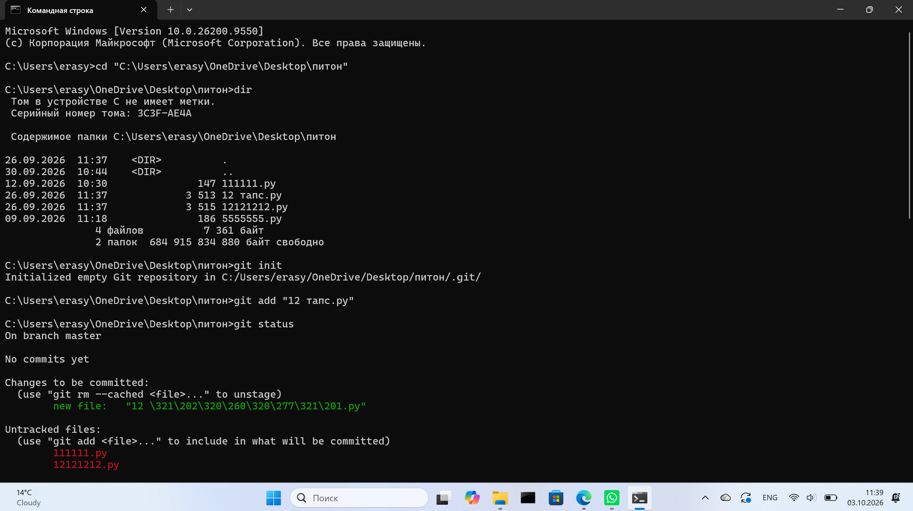
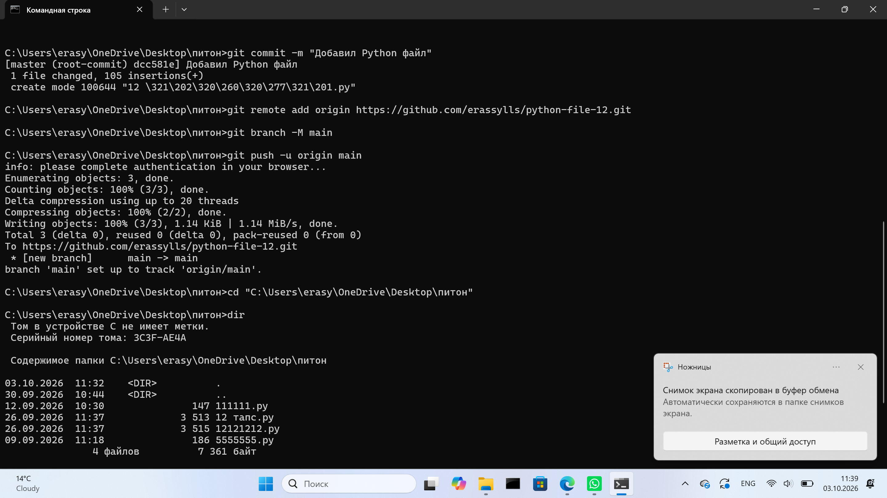
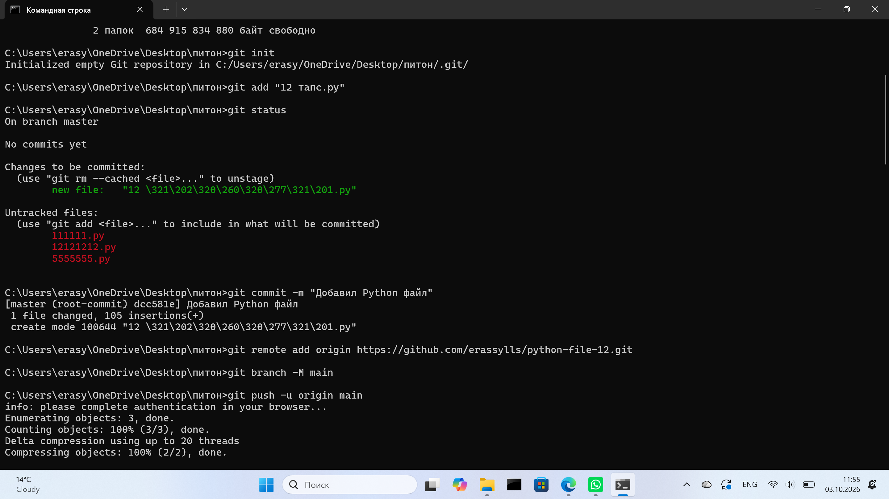
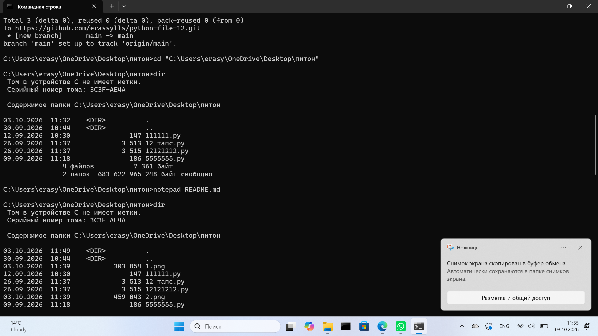
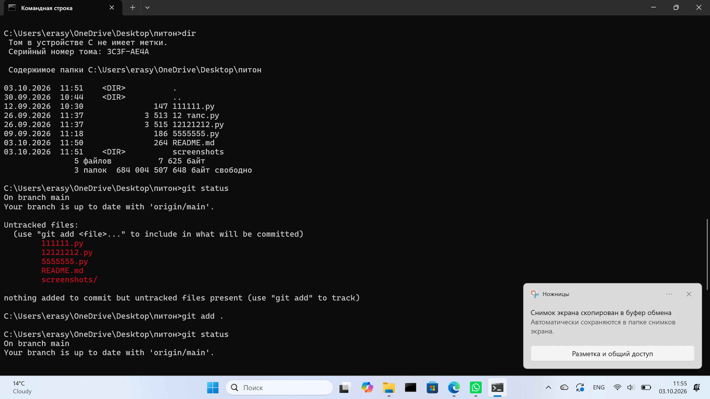
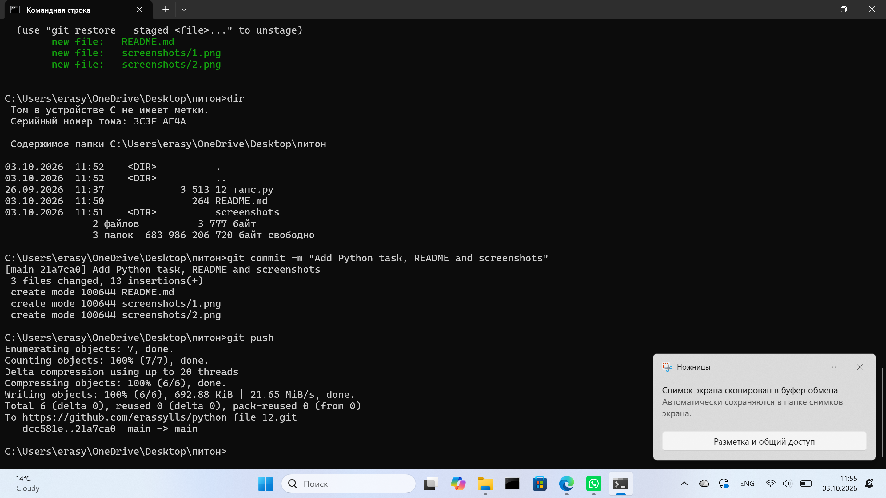

# Vehicle Management System

Учебный проект на Python с использованием ООП.

## Возможности

Программа позволяет:

- добавлять машину, велосипед и самолет;
- сохранять марку и максимальную скорость;
- показывать весь транспорт;
- запускать метод `move()`;
- обрабатывать ошибки ввода.

## Используется

- классы;
- наследование;
- полиморфизм;
- обработка исключений;
- списки объектов.

## Классы

```text
Vehicle
├── Car
├── Bicycle
└── Airplane
```

Каждый класс имеет свой метод `move()`.

Пример:

```text
Машина Toyota едет по дороге
Велосипед Giant едет по дороге
Самолет Boeing летит в небе
```

## Меню

```text
1. Добавить машину
2. Добавить велосипед
3. Добавить самолет
4. Показать транспорт
5. Движение
0. Выход
```

## Обработка ошибок

Программа проверяет:

- пустую марку транспорта;
- скорость меньше или равную 0;
- ввод текста вместо числа;
- `Ctrl + C`;
- `EOFError`.

## Запуск

```bash
python "12 тапс.py"
```

или:

```bash
py "12 тапс.py"
```

## Скриншоты













## Автор

Сайран Ерасыл
